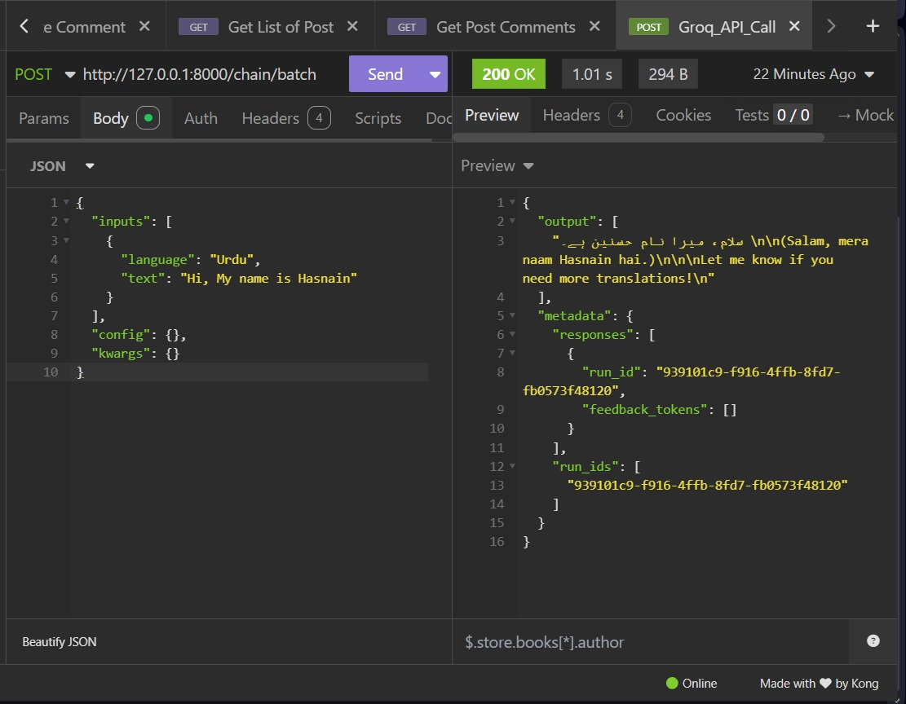

# 🌐 Groq Langchain Translator with FastAPI and Langserve

This project is a **FastAPI-based** microservice that performs **language translation** using **Langchain**, **Groq API** (with the `gemma2-9b-it` model), and **LangServe**. It showcases how to use **LCEL (LangChain Expression Language)** to chain prompts, models, and parsers efficiently.

---

## 🚀 Features

- Translate input text to a target language
- Powered by Groq's `gemma2-9b-it` model
- Built with FastAPI for high-performance API delivery
- Uses LangChain's LCEL chaining for clean modular flow
- LangServe integration for easy API deployment
- use insomnia for API calls

---

## 🧱 Tech Stack

- [FastAPI](https://fastapi.tiangolo.com/)
- [LangChain](https://www.langchain.com/)
- [LangServe](https://docs.langchain.com/langserve/)
- [Groq API](https://console.groq.com/)
- Python `3.10+`

---

## 📦 Setup Instructions

### 1. Clone the Repo

```bash
git clone https://github.com/yourusername/groq-langchain-translator.git
cd groq-langchain-translator
```

## 2. Create and Activate Virtual Environment
```bash
python -m venv venv
source venv/bin/activate  # On Windows: venv\Scripts\activate
```
## 3. Install Dependencies
```bash
pip install requirement.txt
```
## 4. Setup .env File
Create a .env file in the root directory and add your Groq API key:
```bash
GROQ_API_KEY = your_groq_api_key
```
The Groq API is free and can be get from the Groq AI official website

## 🧠 How It Works
### LangChain LCEL Flow
This app uses LCEL (LangChain Expression Language) for clean chaining:
```bash
chain = prompt_template | model | parser
Prompt Template: System and user message formats are defined.
```
- Model: ChatGroq is used with the gemma2-9b-it model.
- Parser: The raw response is parsed to string using StrOutputParser.
- LangServe Integration
We register the LangChain chain to an API endpoint using add_routes():

```bash
add_routes(app, chain, path="/chain")
```
You can now send requests to /chain with JSON input like:
```bash
{
  "input": {
    "language": "French",
    "text": "Hello, how are you?"
  }
}
```
### ▶️ Run the App
```bash
python app_name.py
```

## 🧪 Testing with Insomnia
You can test this API easily using Insomnia — a REST client for sending HTTP requests.

#### ✅ Steps:
- Open Insomnia
- Create a POST request
- Set the URL to:
```bash
http://127.0.0.1:8000/chain/batch
```
- Go to the Body tab, choose JSON, and paste the following: Add Language of you own choice
```bash
{
  "inputs": [
    {
      "language": "Urdu",
      "text": "Hi, My name is Hasnain"
    }
  ],
  "config": {},
  "kwargs": {}
}

```
- Click Send and you’ll receive the translated response.

#### 📸 Example Screenshot


## 🌟 Star This Repo
If you found this useful, consider giving it a ⭐️ to support the project!
Let me know if you want the `requirements.txt` file content too or want to deploy it on Render/Heroku or Dockerize it.
